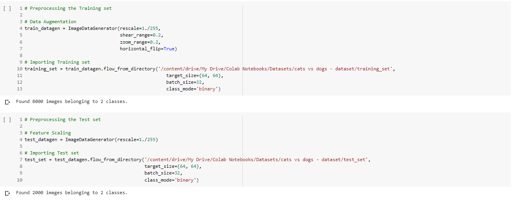
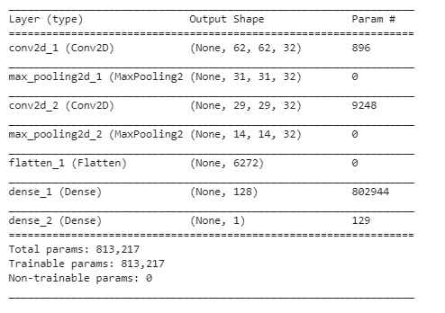
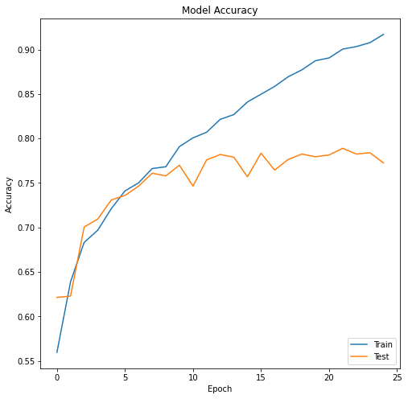
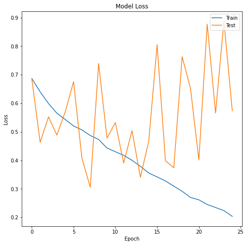

# Cat vs Dog Image Classification
   

### Problem statement:
Implement an algorithm to classify whether images contain either a dog or a cat. 

### Dataset:
The total number of images available for training the model is 8,000 and for testing the model is 2,000 images. 
_• Dataset Link: https://www.kaggle.com/tongpython/cat-and-dog_

### Dependencies:
* Google Colaboratory
* Keras
* Tensorflow - 2.2.0
* Python - 3.6
* Scikit-Learn
* Pandas
* Numpy
* Matplotlib
* Seaborn

### Architecture:

### Data Augmentation
Using some Data Augmentation techniques for more data and Better results.
* Shearing of images
* Random zoom
* Horizontal flips

### Network Parameter:
* Rectifier Linear Unit (ReLU) - Hidden Layers
* Sigmoid - Output Layer
* Adam optimizer
* Loss: Binary CrossEntropy

### Visualization of Model Accuracy:
* Training Set Accuracy: 91.70%
* Test Set Accuracy: 77.25%

### Visualization of Model Loss:
* Training Set Loss: 0.2037
* Test Set Loss: 0.5736

### Future Scope:
Increase the accuracy of the model to more than 95.00% using hyper parameter tuning.
